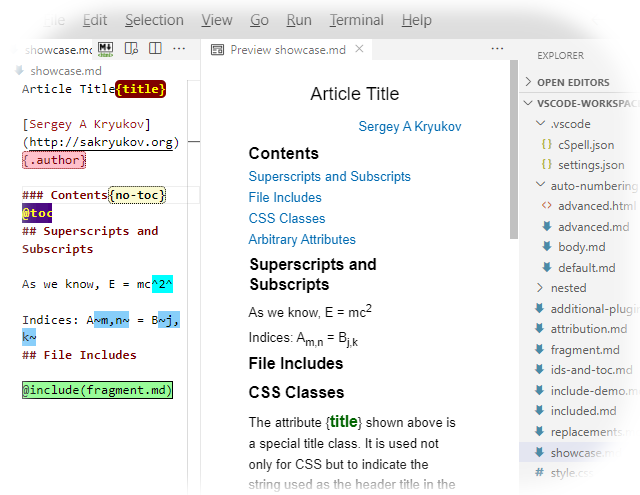

All in One Toolchain for Article Writing with Visual Studio Code{title}

[*Sergey A Kryukov*](https://www.SAKryukov.org)

*New Visual Studio Code extension "Extensible Markdown Converter" augments built-in Markdown extension to form all in one toolchain offering convenient editor, rendered document viewer, spell checker and converter to HTML, per CodeProject article submission requirements*

<!-- <h2>Contents</h2> is not Markdown element, just to avoid adding it to TOC -->
<!-- change style in next line <ul> to <ul style="list-style-type: none"> -->
<!--
For CodeProject, makes sure there are no HTML comments in the area to past!
--> 

---

<!-- copy to CodeProject from here ------------------------------------------->

<ul class="download">
    <li><a href="https://github.com/SAKryukov/vscode-markdown-to-html">Download or clone extension source code from GitHub</a></li>
    <li><a href="Visual-Studio-Code-Markdown-samples.zip">Download Visual Studio Code workspace and document samples &mdash; 8 KB</a></li>
</ul>

<blockquote id="epigraph" class="FQ">
Epigraph:

<i>Beware of advice — even this.</i>

<dd><a href="https://en.wikipedia.org/wiki/Carl_Sandburg">Carl Sandburg</a></dd>
</blockquote>

## Contents{no-toc}

@toc

## Important Note on the Article Update

VSCode changed extension API several time, and I had to change the extension, because new VSCode versions broke backward compatibily. After v.&thinsp;5.8.1, I used two different versions for software development and article wriring.

Finally, I've found time to fix it. Since v.&thinsp;5.8.1, the complete functionality is back, but the latest version of Extensible Markdown may not work with some earlier VSCode versions. Presently, it requires VSCode v.&thinsp;1.84.2. This extension is reintroduced to the [Visual Studio Marketplace](https://marketplace.visualstudio.com/search?term=SAKryukov&target=VSCode). Enjoy!

## Introduction

 In my previous article on the topic, [*Helpful Toolchain for Article Writing*](https://www.codeproject.com/Articles/1177895/Helpful-Toolchain-for-Article-Writing), I expressed [the annoyance of article writing](https://www.codeproject.com/Articles/1177895/Helpful-Toolchain-for-Article-Writing#writing-is-annoying) and tried to explain the importance of better tooling. Some variants of the toolchain I created in response to the challenge greatly improved my writing performance and promoted some piece in mind, but were far from perfection. Even the use of Visual Studio 2015 as a writing tool presented some noticeable delays. Anyway, it worked out as a proof of the concept: this activity pays off with the first article written.

Recently, I tried out [Visual Studio Code](https://code.visualstudio.com) for the first time and immediately paid attention to the support of [Markdown](https://en.wikipedia.org/wiki/Markdown). Could it be used for article writing? My verdict was: "almost there". All the available support and extension could not make a really usable toolchain, without considerable additional efforts, including some code development. Some critically important features were simply missing. After some research, I figured out that the comprehensive solution needs one more [Visual Studio Code extension](https://code.visualstudio.com/docs/extensions/overview), to generate HTML files suitable for immediate submission through the CodeProject article submission wizard, as well as many other purposes. Note that my idea of preparation of an article for CodeProject is the possibility to paste the article to the article submission wizard in one step, without any modifications.

After I created this extension and published it on Visual Studio Marketplace, I found results quite practical. My toolchain became very lightweight and convenient.

This article is fully written with the use of the all in one toolchain based on Visual Studio Code.

## Visual Studio Code   

Why would I try out Visual Studio Code? I'm afraid to say, the benefits of this tool are somewhat understated. The way it is marketed creates the impression that this is a Visual Studio dramatically cut down in features for the sake of multi-platform qualities. This is not true. For example, it's quite unfair to consider [Eclipse](https://www.eclipse.org) as an "[integrated development environment](https://en.wikipedia.org/wiki/Eclipse_%28software%29)" and Visual Studio Code as "[source code editor](https://en.wikipedia.org/wiki/Visual_Studio_Code)".

Perhaps the most impressive quality of Visual Studio Code is its speed, especially in contrast to ["real" Visual Studio](https://www.visualstudio.com). Another pleasing feature: it is really friendly to the developers used to Visual Studio.

Anyway, my initial interest started with attempts to find the best support of development and debugging of [.NET Core](https://dotnet.github.io) code. But this is a whole different story...   

## Available Extensions

There is a number of out-of-the-box Markdown-related Visual Studio Code *extensions* on the [Visual Studio Marketplace](https://marketplace.visualstudio.com). As I could see, at the moment of writing they all had considerable deficiencies or defects. If they were perfect, this article would be totally redundant.

#### VS Code Markdown, Microsoft

Basic Markdown support extension is embedded in Visual Studio Code. It's *id* is "Microsoft.vscode-markdown". It provides basic document authoring and preview. The extension "[Convert Markdown to HTML](https://marketplace.visualstudio.com/items?itemName=sakryukov.convert-markdown-to-html)" is based on this Microsoft extension and augments it with the most missing feature: saving converted Markdown in HTML files.

#### Markdown All in One

This is the first extension I tried out. Despite its name the word "All" in its name seems to be a great exaggeration. Perhaps the only useful feature is its explicit Table of Contents (TOC) generation and update --- see the [description](https://marketplace.visualstudio.com/items?itemName=yzhang.markdown-all-in-one). Nevertheless, I used this extension to generate TOC for [Markdown samples](https://www.codeproject.com/KB/mentor/1194125/Visual-Studio-Code-Markdown-samples.zip), just to avoid the dependency on the "[markdown-it](https://www.npmjs.com/package/markdown-it)" [plug-ins](https://www.npmjs.com/browse/keyword/markdown-it-plugin) I rely on [in my approach](#the-solution-extensible-markdown-converter).

The solution looks too heavy, because it does not depend on the Microsoft "VS Code Markdown" extension. Instead, the solution is based on separate installation of node.js [npm](https://www.npmjs.com) and npm modules, such as [markdown-it](https://www.npmjs.com/package/markdown-it) and [markdown-it-named-headers](https://www.npmjs.com/package/markdown-it-named-headers), and more. The modules are supplied with the extension, duplicating the modules installed with the Visual Code Installation, which may lead to mismatched behavior in future.

Unfortunately, a critical bug was found in [markdown-it-named-headers](https://www.npmjs.com/package/markdown-it-named-headers): identical heading names would break uniqueness of the values of `id` attributes, which generated renders HTML invalid. Besides, it makes little sense to have separate plug-ins for the generation of `id` attributes and Table of Constants. Instead, these two parts of functionality are closely related and should be supported in a unified plug-in, to act consistently.

#### Code Spellchecker Extension

This extension is described [here](https://marketplace.visualstudio.com/items?itemName=streetsidesoftware.code-spell-checker). It provides reasonably convenient spell checking and quick type fix workflow.

Spelling problems are shown directly in the text, so they can be fixed through IntelliSense. In particular, a correct word can be added either to a global (per user) or local (per *workspace*) dictionary. The Markdown formatting does not break the detection of spelling problems. Quite importantly, there is a summary view of the problems, "Spell Checker Information", which can be used to make sure no problems are overlooked, and to turn the feature on or off. Below, I'll show how to add this and other commands to [keyboard binding](#keyboard-binding).

## So, Where is the Problem?

The most important part is not done: generation of the HTML file. So far, we did not get acceptable out-of-the-box Visual Studio Code extensions. Some output the document as HTML, but do in not in the way we can easily use, for example, put the content in the system *clipboard*.

Some ideas are provided on this [Visual Studio Code documentation page](https://code.visualstudio.com/docs/languages/markdown). The main idea is: the conversion to HTML should work as project build, with familiar Ctrl+Shift+B shortcut, show the result in the output window, and so on. For this purpose, proper build task should be defined in ".vscode/tasks.json". 

Will it work? Actually, it won't. There is a number of problems rendering the whole process virtually unusable. Some problems are minor and are easy to fix. But the worst problem is: **the generated file lacks `id` attributes in headings**. This raises the question: why would we automatically generate a TOC with the extension code, if it won't work with the resulting HTML anyway? Notably, the extension preview navigates with TOC correctly. This is done via another [node.js](https://nodejs.org) module, "[markdown-it-named-headers](https://www.npmjs.com/package/markdown-it-named-headers)", a plug-in for "markdown-it". It cannot be used via the command-line "markdown-it" interface, as named headers are optional and not exposed through command-line arguments. Besides, they can be considered dangerous. Before explaining my solution, I need to give the reader a warning:

> **Warning:**
Unfortunately, in automatic `id` and TOC generation, there is nothing to guarantee uniqueness of `id` values, as it is done in some processors (such as [Pandoc](http://pandoc.org), for example). Possible `id` clash, strictly speaking, would render HTML invalid. At least, the anchor-based navigation on the CodeProject article page can be broken. That said, it can happen if one creates two or more identical headers or explicitly enter non-unique `id` attributes in HTML.

Despite of this problem, uniqueness of the `id` values is not broken in the case if identical headings; this problem is solved in Extensible Markdown Converter, version 4.0.0.

Having said that, let's consider really working solution, based on creation of separate Visual Studio Code extension.

## The Solution: Extensible Markdown

The techniques of extension development are described in the [Visual Studio Code documentation](https://code.visualstudio.com/docs/extensions/publish-extension).

### Markdown-it Initialization

Main idea of the solution is this: instead of packaging full set on npm modules for Markdown support, we need to reuse the resources provided by the dependency extension "[VS Code Markdown](#vs-code-markdown-microsoft)":{id=src..main.js}

<pre lang="JavaScript">
// extension host makes it always accessible to extensions:
var vscode = require('vscode');  

const idToc = require("./id.toc.js");

//...

if (!lazy.markdownIt)
    lazy.markdownIt = (function () { // modify, depending in settings
    const extension = vscode.extensions.getExtension("Microsoft.vscode-markdown");
    if (!extension) return;
    const extensionPath = path.join(extension.extensionPath, "node_modules");
    let md = require(path.join(extensionPath, "markdown-it"))().set(optionSet);
    md.use(idToc, {
        enableHeadingId: lazy.settings.headingId, 
        idPrefix: lazy.settings.headingIdPrefix,
        stringModule: require(path.join(extensionPath, "string")),
        markerPattern: new RegExp(lazy.settings.tocRegex, "m"),
        includeLevel: lazy.settings.tocIncludeLevels,
        tocContainerClass: lazy.settings.tocContainerClass,
        tocListType: lazy.settings.tocListType
    });
    for (let pluginData in additionalPlugins) {
        let plugin;
        try {
            plugin = require(additionalPlugins[pluginData].name);
        } catch (requireException) {
            continue;
        } //exception
        md = md.use(plugin, additionalPlugins[pluginData].options);
    } // using additionalPlugins
    return md;
})();

// now we can use markdownIt to render HTML

//...
</pre>

Here, two [node.js](https://nodejs.org) modules are loaded: "[markdown-it](https://www.npmjs.com/package/markdown-it)" and "string". They come with the embedded extension ""Microsoft.vscode-markdown" and can be found by its `id`. The extension "string" is used by the module "idToc" embedded in the extension "Extensible Markdown Converter". It implements generation of headings `id` attributes and Table of Contents and plays the role of the [markdown-it](https://www.npmjs.com/package/markdown-it) plug-in.

Note that the function setting up `markdownIt` also loads *additional plug-ins*. The plug-ins can be installed in some arbitrary directory by the user and configured in "settings.json" shown [explained below](#heading.customized-workspace-settings).

### Performance Optimization with Lazy Evaluation

Another interesting point is using *lazy evaluation*. The extension itself is loaded lazily, only on the events when it is really required. It would be tempting to perform relatively long operations, such as [markdown-it](https://www.npmjs.com/package/markdown-it) setup and processing of the setting, during extension activation, and not during execution of each commands. It won't work correctly though, because between commands the use can enter some changes rendering current state of [markdown-it](https://www.npmjs.com/package/markdown-it) or settings data invalid. In particular, the user can edit settings or simply one or another CSS file. Lazy evaluation combined with some invalidation mechanism solves this problem. This is how:{id=src..lazy.js}

<pre lang="JavaScript">
const lazy = { markdownIt: undefined, settings: undefined };

// ...

if (!lazy.settings)
    lazy.settings = getSettings();

// ...

if (!lazy.markdownIt) // already shown in first code sample
    lazy.markdownIt = (function () {
        // ...
    };    

// ...

vscode.workspace.onDidChangeTextDocument(function (e) {
    if (e.document === vscode.window.activeTextEditor.document)
        provider.update(previewUri);
    if (e.document.languageId == "css") // any change in CSS is detected
        lazy.settings = undefined;
}); //vscode.workspace.onDidChangeTextDocument
vscode.workspace.onDidChangeConfiguration(function (e) {
    lazy.settings = undefined;
    lazy.markdownIt = undefined;
}); //vscode.workspace.onDidChangeConfiguration
</pre>

### Auto-Numbering

Version 5.0.0 introduced optional user configured auto-numbering with rich set of features. It is implemented as a part of the embedded plug-in. This plug-in is also published on [npm](https://www.npmjs.com) as a [separate product](https://www.npmjs.com/package/markdown-it-id-and-toc).

First of all, all options come on two levels: general for the entire document (named `default*`) and per heading level, described in the property `pattern`. The exclusion is the option `standAlong` which appears only in `patter` and is only defined for individual heading levels. 

By default, a heading number is shown as a multi-component string including number of upper-level headings, such as in "2.11.3". The option `standAlong` is used to disable upper-level part, showing, in this example, just "3".

| Property Name | Default | Description |
| --- | --- | --- |
| prefix defaultPrefix | `""` | String which comes before number. Typical used include "Chapter ", "Part " |
| suffix defaultSuffix | `". "` | String which comes after number. It is used to separate number and heading caption |
| start defaultStart | 1 | Starting number in each numbered section. It can be any integer number, any string parsable to an integer number or any character. |
| separator defaultSeparator | 1 | Starting number in each numbered section. It can be any integer number, any string parsable to an integer number or any character. | . | String (most typically, as single-character string) delimiting components of number inherited from upper-level headings |
| standAlong | `undefined`| "Stand along" flag defining that for some individual levels of headings, the components of number inherited from upper-level headings are not shown |

Example of auto-numbering options defined as a first paragraph in the document:
<pre lang="text">
 ", "standAlong": true }
    ]
}=)
</pre>

Version 5.8.0 introduced new simplified format for the in-document specification of the auto-numbering options.

The format used previously is JSON; it still can be used, but it is not very suitable for human input and is not fault-tolerant. Presently, it takes precedence. If JSON parsing fails, new parser tried to parse the content of the `` tag using new grammar:

* Each property is placed on a separate line
* Leading and trailing blank spaces and spaced between syntactic elements are ignored
* Line syntax: `<property>: <value>`
* Document properties:
    - enabled: true
    - defaultStart: `<value>`
    - defaultSeparator: `<value>`
    - defaultPrefix: `<value>`
    - defaultSuffix: `<value>`
* Heading level properties:
    - h`<level>`.standAlong: true
    - h`<level>`.start: `<value>`
    - h`<level>`.separator: `<value>`
    - h`<level>`.prefix: `<value>`
    - h`<level>`.suffix: `<value>`
    here, `<level>` values 1, 2, ... correspond to Markdown headings `#`, `##`, ... or HTML elements `h1`, `h2`, ...
* Valid values for .start, defaultStart:
    - integer number
    - string (in this case, only first character is used)
    - array of strings

If a line fails to parse, it is ignored. It can be used for comments.

Example of auto-numbering option in-document specifications:
<pre lang="text">
 "
}=)
</pre>

Auto-numbering "start" option can be any integer number or a string representing such number, any character, or, since version 5.5.5, an array of strings representing heading numbers, such as `["One", "Two", "Three"]`. These different categories are iterated in natural different ways. In particular, a character-based name is iterated by incrementing of its Unicode *code point*, such as in "A", "B", "C"...

In implementation, an interesting point here is the universal `Iterator` covering all these cases: 

<pre lang="JavaScript">
function Iterator(first) {
    if (first.constructor == Array) this.array = first;
    this.counter = this.array ? 0 : first;
    Iterator.prototype.toString = function () {
        return this.array ?
            this.array[this.counter].toString() : this.counter.toString()
    }; // toString
    Iterator.prototype.next = function () {
        if (this.array)
            if (!this.array[this.counter + 1]) {
                this.counter = this.array[this.array.length - 1];
                delete this.array;
            } else
                this.counter++;
        if (!this.array) { // again, because it could have changed by delete this.array 
            let tryNumeric = parseInt(this.counter);
            if (isNaN(tryNumeric)) {
                let codePoint = this.counter.codePointAt();
                this.counter = String.fromCodePoint(++codePoint);
            } else
                this.counter = (++tryNumeric).toString();
        } //if
        return this;
    } //next
} //Iterator
</pre>

Let's see how it works.

Let's say, we have the following Markdown fragment, included in other Markdown files, different in auto-numbering options:
<pre lang="JavaScript">
## Contents

## Introduction

## Something Else 

### Section

### Another Section

#### Sub-Section
</pre>

To enable default auto-numbering include it in this way:
<pre lang="JavaScript">

)
</pre>

It will give as the following TOC:

<ul style="list-style-type: none;"><li>1. <a href="#heading.contents">Contents</a></li><li>2. <a href="#heading.introduction">Introduction</a></li><li>3. <a href="#heading.something-else">Something Else</a><ul style="list-style-type: none;"><li>1. <a href="#heading.section">Section</a></li><li>2. <a href="#heading.another-section">Another Section</a><ul style="list-style-type: none;"><li>3.2.1. <a href="#heading.sub-section">Sub-Section</a></li></ul></li></ul></li></ul>

Now, let's use some advanced auto-numbering options:
<pre lang="JavaScript">
 "
    h4.standAlong: true
}=)

)

## Out of Chapter Names

No more names in "start": ["One", "Two", "Three", "Four"]

## Using Letters Instead of Names
</pre>

It will give us more fancy TOC:

<ul style="list-style-type: none;"><li>Chapter One: <a href="#heading.contents">Contents</a></li><li>Chapter Two: <a href="#heading.introduction">Introduction</a></li><li>Chapter Three: <a href="#heading.something-else">Something Else</a><ul style="list-style-type: none;"><li>1 <a href="#heading.section">Section</a></li><li>2 <a href="#heading.another-section">Another Section</a><ul style="list-style-type: none;"><li>a) <a href="#heading.sub-section">Sub-Section</a></li></ul></li></ul></li><li>Chapter U: <a href="#heading.out-of20chapter20names">Out of Chapter Names</a></li><li>Chapter V: <a href="#heading.using-letters20instead20of20names">Using Letters Instead of Names</a></li></ul>

Note that iteration by `["One", "Two", "Three", "Four"]` array went out of elements. Then next iteration is performed in the following way: the last element is parsed as a character and incremented by its code point. It gives us "U" and "V". This feature is designed to handle such situation gracefully, so the author could easily detect where more array elements needs to be supplied, without breaking if the TOC structure.

Also note heading number 1, 2 and "a)". This is where the "standAlong" option is used, and the specialized `"suffix": ") "` for "a".

### Setting up Additional Plug-ins

The object `additionalPlugins` is constructed from the settings data in conservative manner: if something goes wrong, plug-in data is not added:{id=src..additional.plugins.js}

<pre lang="JavaScript">
const additionalPlugins = (function () {
    let result = [];
    if (!settings.additionalPlugins) return result;
    if (!settings.additionalPlugins.plugins) return result;
    if (!settings.additionalPlugins.plugins.length) return result;
    if (settings.additionalPlugins.plugins.length &lt; 1) return result;
    let effectiveParentPath = settings.additionalPlugins.absolutePath;
    if (!effectiveParentPath) {
        let relativePath = settings.additionalPlugins.relativePath;
        if (!relativePath) return result;
        relativePath = relativePath.toString();
        effectiveParentPath =
            path.join(vscode.workspace.rootPath, relativePath);
    } //if 
    if (!effectiveParentPath) return result;
    if (!fs.existsSync(effectiveParentPath.toString())) return result;
    for (let pluginDataProperty in settings.additionalPlugins.plugins) {
        const pluginData =
            settings.additionalPlugins.plugins[pluginDataProperty];
        if (!pluginData.name) continue;
        const effectivePath =
            path.join(
                effectiveParentPath.toString(),
                pluginData.name.toString());
        if (!fs.existsSync(effectivePath)) continue;
        if (!pluginData.enable) continue;
        result.push({name: effectivePath, options: pluginData.options});
    } // loop settings.additionalPlugins.plugins
    return result;
}()); //additionalPlugins
</pre>

Naturally, "package.json" should claim the extension "[VS Code Markdown](#vs-code-markdown-microsoft)" in its dependencies:

<pre language="Javascript">
{
    "name": "convert-markdown-to-html",
    "displayName": "Convert Markdown to HTML",
    "description": "Converts Markdown files and saves them as HTML",

    // ...
    
    "dependencies": {
        "vscode": "^1.13.1"
    },
    "extensionDependencies": [
        "Microsoft.vscode-markdown"
    ],
    
    // ...

}
</pre>

The function [`getMarkdownPlugin`](#src..main.js) solves some more problems unsolved by existing extensions. First, it enables generation of `id` attributes in headings, which are used in TOC and elsewhere. Another important improvement is the use of the [markdown-it](https://www.npmjs.com/package/markdown-it) *typographer*.

One noticeable annoyance of the extension preview was that the *typographer* feature of the node.js module "markdown-it" is not used. I wrote about similar feature [in my previous article](https://www.codeproject.com/Articles/1177895/Helpful-Toolchain-for-Article-Writing) on the topic; check out the description of the "--smart" command-line option. In terms of the "markdown-it" module, this is the *typographer* option, which should be set before rendering. This is done in the conversion script "build.js", so the input markup such as em dash ("&dash;&dash;&dash;"), apostrophes or unpaired quotation marks will be shown in a typographically correct way as "---", "", "'", etc.    This way, the extension preview and the final output will look different. Another reason for the difference is "fancy formatting" of the preview, not entirely controlled by CSS.

The typographer behavior is explained in detail in the ["Extensible Markdown Converter" documentation](https://sakryukov.github.io/vscode-markdown-to-html/#typographer).

The problem of mismatch between preview and generated HTML file was solved in version 2.2.0. Now preview precisely matches the file, because it's generated from the same source. For further detail, please see [documentation on preview](https://sakryukov.github.io/vscode-markdown-to-html/#preview).

Another feature to implement is adding the HTML header and footer to the generated body. The module [markdown-it](https://www.npmjs.com/package/markdown-it) itself does not do it. There is one particular reason why it is important enough: UTF-8 encoding needs to be specified in the `head` element, to make rendering correct. CodeProject does it anyway, but it's important to check up the document before pasting it to the CodeProject article submission wizard.

For other implementation detail, please see [original source code](https://github.com/SAKryukov/vscode-markdown-to-html).
 
## Customized Workspace Settings

All settings can be customized either globally (per user), or per *workspace*. We can use it to customize markdown preview and behavior (first of all, IntelliSense) to become suitable for the workspace used for article authoring. To do it per workspace, we need to create a file ".vscode/settings.json":{id=src..settings.json}

<pre lang="JavaScript">
{
    "markdown.extension.convertToHtml.reportSuccess": true, // default
    "markdown.extension.convertToHtml.showHtmlInBrowser": false, // default
    "markdown.extension.convertToHtml.embedCss": false, // default
    "markdown.extension.convertToHtml.outputPath": "", // default
    "markdown.extension.convertToHtml.titleLocatorRegex":
        "^(.*?)\\[\\]\\(title\\)", // default
    // markdown-it options, all defaults:
    "markdown.extension.convertToHtml.options.allowHTML": true,
    // "markdown-it-named-headers" plug-in,
    // adds id attributes to h1 .. h6 elements:
    "markdown.extension.convertToHtml.options.headingId": true,
    // converts "link-like" text: for ex., "http://my.com"
    // to HTML anchors:
    "markdown.extension.convertToHtml.options.linkify": false,
    // replaces new line marker with br HTML element:
    "markdown.extension.convertToHtml.options.br": true,
    // typographer, see the documentation:
    // https://sakryukov.github.io/vscode-markdown-to-html/#typographer
    // :
    "markdown.extension.convertToHtml.options.typographer": true,
    // applicable if typographer is true:
    // 4 characters, replacement for "" and '':
    "markdown.extension.convertToHtml.options.smartQuotes": "“”‘’",    
    "markdown.extension.convertToHtml.options.additionalPlugins": {
        "absolutePath": null, // just a placeholder
        // relative to workspace:
        "relativePath": "../additional_plugins/node_modules", 
        "plugins": [
            {
                "name": "markdown-it-sub",
                "enable": true
            },
            {
                "name": "markdown-it-sup",
                "enable": true
            },
            {
                "name": "markdown-it-table-of-contents",
                "options": {
                    "includeLevel": [2, 3],
                    "containerClass": "toc",
                    "listType": "ul"
                },
                "enable": true
            },
            {
                "name": "markdown-it-footnote",
                "enable": true
            }
        ]
    },
    "markdown.styles": [
        // same styles used for preview are used in converted HTML files:
        "style.css", 
        "someMoreStyles.css"
    ],
 
    // ...

    // Very important: remove entered words from suggestions,
    // leave only markdown syntax:
    "editor.wordBasedSuggestions": false,
    "[markdown]": { // for Markdown language id only:
        "editor.codeLens": true,
        "editor.lineNumbers": "off",
        "editor.rulers": [
            79 //CodeProject requirements for source code samples
        ]
    },
    "git.enabled": false, // git is used, but not with VS Code integration 
    "cSpell.enabled": true // default
}
</pre>

All the options above "`markdown.styles`" are introduced by the extension "[Extensible Markdown Converter](https://marketplace.visualstudio.com/items?itemName=sakryukov.convert-markdown-to-html)". The option "`markdown.styles`" is shared by this extension and its dependency extension "[VS Code Markdown](#vs-code-markdown-microsoft)". If one of more CSS files is defined, they are used in the generated HTML files as *external* or *embedded* style sheets, depending on the option "`markdown.extension.convertToHtml.embedCss`". The user is responsible for supplying the CSS files themselves.

Perhaps the most interesting "[Convert Markdown to HTML](https://marketplace.visualstudio.com/items?itemName=sakryukov.convert-markdown-to-html)" option is "markdown.extension.convertToHtml.options.additionalPlugins". Their behavior is explained in the [extension documentation](https://github.com/SAKryukov/vscode-markdown-to-html/wiki/VSCode:-Extensible-Markdown-Converter).

Note one specific plug-in package, "[markdown-it-table-of-contents](https://www.npmjs.com/package/markdown-it-table-of-contents)". It has its own options. They are transparently passed from "settings.json" to the extension code. The code fragment [shown above](#src..main.js) explains how it is implemented.

The process of modification of settings is explained [here](https://code.visualstudio.com/docs/getstarted/settings). It makes certain sense to open the original file in Visual Studio Code and edit in text format, to keep full control and take the benefits of IntelliSense.

Some settings are copied to the local file ".vscode/settings.json" and not modified but added for convenience of experimenting; most of them are omitted from this code sample. Note two critical items: "editor.wordBasedSuggestions" and "editor.rulers". First one is a work-around against showing all previously entered words as IntelliSense suggestions. The second one draws a vertical line at column 79, which is important for code samples: CodeProject requires all code sample lines to be within the 80-column range.

## Putting All Together: Cookbook Recipe

1. Install [Visual Studio Code](https://code.visualstudio.com); it will also install the built-in extension "VS Code Markdown" by Microsoft;
1. Install Visual Studio Code extension "[Convert Markdown to HTML](https://marketplace.visualstudio.com/items?itemName=sakryukov.convert-markdown-to-html)", described in the present article;
1. Install Visual Studio Code extension "[Code Spellchecker](https://marketplace.visualstudio.com/items?itemName=streetsidesoftware.code-spell-checker)";
1. Open some folder with Markdown documents with Visual Studio Code; in the code sample supplied with this article, this is the root directory, where ".vscode" is found.

Optionally, I would also recommend installing Visual Studio Code extension "[Numbered Bookmarks](https://marketplace.visualstudio.com/items?itemName=alefragnani.numbered-bookmarks)"; they are very useful for editing.

Everything is ready. Now you can test it. Create and open some .md file. In the editor, you will get the following commands:

1. "Ctrl-space": see a [list of suggestions](#img.title) in Markdown syntax and chose a snippet to enter;
1. "Ctrl+.": if "Code Spellchecker" extension is activated, a problematic word is underlined and a cursor is located within this word, get a list of quick-fix suggestion and chose a corrected word;
1. "Ctrl+Shift+V": Open Preview;
1. "Ctrl+K V": Open Preview on side;
1. "Ctrl+/": comment out or un-comment current line or selection;
1. Editor context menu: "Markdown: Convert to HTML", converts the file loaded in a currently activated editor.
1. Editor context menu, Explorer context menu: "Markdown: Convert to HTML all .md files in workspace".

For full list of Markdown-related commands, press either F1 or Ctrl+Shift+P and enter "Markdown"; look for other commands as required.

## Versions

#### Initial version{no-toc}

June 29, 2017 

#### Version 1.0.3{no-toc}

July 4, 2017

Code is rewritten from scratch and published on Visual Studio Marketplace as a Visual Studio Code Extension ["convert-markdown-to-html"](https://marketplace.visualstudio.com/items?itemName=sakryukov.convert-markdown-to-html).

Article is almost completely rewritten.

#### Version 1.1.0{no-toc}

July 5, 2017

Added support for multiple CSS files and the option to embed CSS code in HTML.

#### Version 1.1.1{no-toc}

July 5, 2017

Fixed a bug in a relative path to CSS files.

#### Version 2.1.0{no-toc}

July 8, 2017

The Visual Studio Code extension title modified to "Extensible Markdown Converter". 

Since v. 2.0.0, the user can extend Markdown features by installing any of the ["markdown-it" plug-ins](https://www.npmjs.com/package/markdown-it) that are [abundantly available](https://www.npmjs.com/browse/keyword/markdown-it-plugin) in the [npm package registry](https://www.npmjs.com). All the packages can be configured from a single source: "settings.json", [on the user or workspace level](https://code.visualstudio.com/docs/getstarted/settings).

That said, there is no a need for different Markdown extensions. It's quite enough to have only the built-in extension combined with Extensible Markdown Converter. All required functionality can be assembled from available plug-ins using the single unified configuration design.

After this version was published, due to these radical improvements, the article was massively updated.

#### Version 2.2.0{no-toc}

July 9, 2017

- Implemented preview identical to generated HTML
- Improved performance (lazy evaluation of markdown-it module setup and settings)
- In settings, implemented "outputPath" option

Markdown code samples updated. Now they illustrate [additional plug-ins](https://sakryukov.github.io/vscode-markdown-to-html/#additional-plug-ins) and newly developed techniques, such as [title detection](https://sakryukov.github.io/vscode-markdown-to-html/#detecting-document-title).

#### Version 3.0.0{no-toc}

July 13, 2017

* Implemented extensible Markdown syntax coloring for each plug-in syntax, user-configurable
* Implemented user-configurable syntax coloring for document title in input Markdown
* Implemented file includes, with user-configurable syntax coloring
* Added keybinding, to overwrite "VS Code Markdown" preview key bindings

The change relative to version 2.3.0: location of the included file is now relative to the Markdown document location.

#### Version 4.3.0{no-toc}

Accumulated changes since Version 3.0.0:

* Found critical bug in the external "markdown-it-named-headers" and "markdown-it-table-of-contents": generated id values of headers were not unique. As a work-around, these external modules are eliminated and replaced with modules embedded in the extension.

Major version is incremented because the default Markdown pattern for Table of Content has changed to `^\[\]\(toc\)`, which means "``" at the beginning of line. Potentially, it could break backward compatibility with existing Markdown documents using "`[[toc]]`", but it's easy to fix.

* Added settings option: "markdown.extension.convertToHtml.tocIncludeLevels", default [1, 2, 3, 4, 5, 6]
* Added settings option: "markdown.extension.convertToHtml.tocContainerClass", default "toc"
* Added settings option: "markdown.extension.convertToHtml.tocListType", default "ul"
* Table of Contents and generation of heading `id` attributes unified in a single embedded module.
* Added settings option: "markdown.extension.convertToHtml.options.headingIdPrefix", default "heading."
* Fixed a bug in heading `id` attribute generation; now the set of used `id` values is reset on each rendering
* Added logo

#### Version 5.8.0{no-toc}

Fixed additional plugins feature, entire functionality re-tested

#### Version 5.8.1{no-toc}

Accumulated changes since Version 4.3.0:

* Added advanced Markdown extension features based on embedded markdown-it plug-in:
	- Syntax extension: a tag to mark a heading to be excluded from TOC 
	- Extended options to make a choice between `ul` or `ol` elements in TOC, either globally or per TOC level
	- Extended options to add sets of HTML attributes to TOC list elements, either globally or per TOC level
    - Optional user-configurable [auto-numbering](#heading.auto-numbering) with rich set of features
* Added images to conversion and preview commands and menu items to the editor title
* Improved images
* Found critical bugs in the legacy code of the embedded markdown-it plug-in, so this module is fully re-written
* Improved handling of the case of invalid JSON in the in-doc auto-numbering specifications
* Introduced new simplified format for in-document specifications of the auto-numbering options
* Improved id generation.

The new current set features of features provides comprehensive handling of headings and TOC. Two related user-configurable syntax extensions are used "TOC" (by default, ` and "Exclude from TOC" (`by default, `. The `id` values and their references from TOC's `<a href...>` anchors are created from a single source and guarantee referential integrity and uniqueness. The markers themselves are removed from output, unless the feature is disabled.

#### Version 5.2.0{no-toc}

Extended syntax changed. Please see the [current syntax here](https://sakryukov.github.io/vscode-extensible-markdown/index.html).

Restored compatibility with later VSCode versions based on v.&thinkp;1.84.2

#### Version 5.3.0{no-toc}

Updated documentation

## Conclusions

After few prototypes of the solution and creation of the fully-fledged extension, I feel the result is pleasing. Since the first version, I already wrote many CodeProject articles, including the present article, and other documents. For the CodeProject publications during last years, I never touched the article text manually on the CodeProject article submission page. Instead, I only used copy and paste of the HTML, produced by this extension.

Since the first version of Extensible Markdown, Visual Studio Code seriously matured and now looks stabe, healthy and maintainable. It makes a great development tool, which can be used for article writing, with pleasure and piece in mind.

Happy writing!

<!-- copy to CodeProject to here --------------------------------------------->
